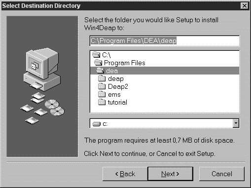

# **Win4DEAP**

**Version 1.1.4**  
**© copyright 2002-2014 Michel Deslierres**
 
**Win4DEAP** provides a convivial Windows front end for **DEAP** written by Tim Coelli. As the name implies, **Win4DEAP** is ***not*** a replacement for **DEAP**. It is the latter which performs the numerical calculations required in data envelopment analysis. **Win4DEAP** cannot make DEA calculations without an installed copy of `DEAP.EXE`. On the other hand `DEAP.EXE`, a DOS console program, will work perfectly well without **Win4DEAP**. 

There is a successor to Win4DEAP called Win4Deap 2. The latter should be used if at all possible.  What follows is of historical interest only.

 

**Content**

<!-- TOC -->

- [1. Introduction](#1-introduction)
- [2. Obtaining **Win4DEAP**](#2-obtaining-win4deap)
- [3. Installing](#3-installing)
- [4. Example files](#4-example-files)
- [5. Instructions for use of **Win4DEAP**](#5-instructions-for-use-of-win4deap)
- [6. Removing **Win4DEAP**](#6-removing-win4deap)
- [7. DISCLAIMER and WARNING](#7-disclaimer-and-warning)
- [8. PUP](#8-pup)
- [9. WinDEAP.sas](#9-windeapsas)
- [10. Acknowledgement](#10-acknowledgement)
- [11. Latest changes](#11-latest-changes)

<!-- /TOC -->

## 1. Introduction

The application provides a grid not unlike a spreadsheet to enter data and writes the necessary instruction and data files for **DEAP**. This means that it is possible to have data files in a folder other than **DEAP**'s. **Win4DEAP** is a 32-bit Windows application. It has been tested on Windows XP, Vista, 7 and 8.1 (32 and 64 bit) but it probably runs on all versions of Windows starting with Windows 98.

The screen shot shows the data entry page of **Win4DEAP**. It contains the data from the first example file provided by Prof. Coelli with his DEA programme **DEAP**. The results after invoking `DEAP.EXE` twice are available but cannot be seen. They would be visible by pressing the 'Run 1' or the 'Run 2' tab. A third run is about to be performed. Note how DMU3 and OUT2 are disabled. They will not be included in this run.

## 2. Obtaining **Win4DEAP**

Two packages are available:

1. `WinDEAP114.EXE` ([download link](WinDEAP114.exe))

An installation program which takes care of most of the details. Its use is described below.
Note: `*.ded` files are associated with **Win4DEAP** during the installation.  

| Hash |  WinDEAP114.exe checksum  |
|---   |--- |
| md5  | 3cd6c27762a35239487e2541c29f3ecf|
| sha1 | 4d2577e911b303fb8e58b78a466407e903450b56 |

2. `WinDEAP114.ZIP` ([download link](WinDEAP114.zip))

All the files to do your own installation.

| Hash |  WinDEAP114.zip checksum  |
|---   |--- |
| md5  | 937bdefe9ab995b9f148279ce99b0323 |
| sha1 | 7ff12d31c38684c38f6fd5b5834fa8a79ed97ac3 |

Click on the above links to start downloading the files. Please verify the checksums to make sure the download occurred without error. It is very important to run these checks, particularly if you downloaded the files from some other site. See PUP below.

## 3. Installing

1. Make sure Tim Coelli's program `DEAP.EXE` is installed and running on your computer. It can be found Centre for Efficiency and Productivity Analysis at the University of Queensland. It bears repeating, make sure `DEAP.EXE` works before trying to install **Win4DEAP**.

    Newer versions of Windows are less tolerant and it will be difficult to run `DEAP.EXE` from the "Program Files" or "Program Files (x86)" folder. It is best to install **DEAP** in its own subfolder in a folder where the user has owner rights such as the `Documents` folder.

2. Remove any old version of **Win4DEAP**. If the installation program was used with the older version, there is an uninstall program to remove it.

3. Click on the downloaded installation program WinDEAP114.EXE to start it.

   The destination folder (directory) for **Win4DEAP** can be any folder desired.

   **Win4DEAP** can be installed in the same directory as `DEAP.EXE`. It will eliminate the need for the next step. Click on the folder containing `DEAP.EXE` in the `Select Destination Directory` dialogue. "**Win4DEAP**" will then be tacked on to the directory (See the figure below where `DEAP.EXE`'s directory is `C:\Program Files\DEA\deap`). Remove `\Win4DEAP` if tacked on. Answer `Yes` when asked if `you would like to install to that directory anyway`.

4. If **Win4DEAP** was installed in a directory other than **DEAP**'s, it will be necessary to specify the location of `DEAP.EXE`. This has to be done once. It can be done now or it can be done the first time a DEA analysis is run. To do it now, start `Win4DEAP.EXE` and click on `Preferences` in the `File` menu. Enter the full path to `DEAP.EXE`. It will be clear if the path is correct or not.

## 4. Example files

Tim Coelli's four examples are provided in **Win4DEAP** format (extension `.ded`). They are in a folder called, appropriately, `Examples` which is itself located in the folder in which **Win4DEAP** was installed.

## 5. Instructions for use of **Win4DEAP**

**Win4DEAP** behaves much like a spreadsheet. It should be relatively easy to use for those familiar with Excel, Quattro etc. As of version 1.1.0 a help file is included with **Win4DEAP**.

By default, WinHelp format help is not displayed in Windows Vista, 7 or 8. WinHelp can be installed, for free, on such systems. Consult http://support.microsoft.com/kb/917607 for details and links to the software. If you do not wish to install WinHelp, or if it does not work, a version of the help file in the newer `chm` (compiled html) format is installed along with **Win4DEAP**. The `chm` file can be displayed from the Help menu. Unfortunately, **Win4DEAP** itself does not know about this file and cannot use it to display contextual help topics.

## 6. Removing **Win4DEAP**

An uninstall program is installed along with `Win4DEAP.EXE`. See the help file for further details.

## 7. DISCLAIMER and WARNING

**Win4DEAP** is free software that is provided as is. The author of the program accepts no responsibility for any damages that could be caused by this software and makes no warranty, whether implied or implicit, about its fitness for any purpose. The user assumes all risks associated with the program.

**Win4DEAP** should be considered beta software. Backup data often and in both the native DED format and standard CSV or TXT formats.

## 8. PUP

I recommend strongly that you download this application from here or from a trusted source (such as a professor making it available on a campus intranet). Some dubious sites are advertising it in a way that masks its source, perhaps even bundling PUPs (Potentially Unwanted Programs) along with **Win4DEAP**.

There was a site with the title *How To Fix Michel Deslierres Win4DEAP*, which was a bit scary. What needed fixing, me or my application? It suggested that you download a utility to repair everything. By the way, the site claimed that the repair tool would work on Android even though my application cannot not run on Android. Even funnier are the 5 star rating it gives itself, claiming 361,927 downloads (1) in November 2015 only. Not bad, given that **Win4DEAP** might have been downloaded 100 times in a year tops!

Of course, I am beyond fixing, and no third party can fix anything (2) to do with **Win4DEAP**, I have never released the code, nor will I ever. It's just too ugly.

If you have an application or document that you think would be useful to users of **Win4DEAP**, put up separate links to both WinDeap114.exe and your additional material.

> (1) The figure is from a check on the 6th of December 2015 of that, let's say "amusing", site.

> (2) With the exception of removing the application and its entries in the registry.

## 9. WinDEAP.sas

The **WinDEAP.sas** file ([download link](WinDEAP.sas)) is a macro that generates a **WinDEAP** file with `.ded extension` from a SAS data set. Further explanations are contained in the comment at the top of the file. This file was created by Julien Ciccone.

## 10. Acknowledgement

Thanks to Tim Coelli for **DEAP** without which **Win4DEAP** is of no use.

Thanks to Jordan Russell for the Inno Setup Compiler which was used to create the installation program. The setup compiler can be found on the Web at http://www.innosetup.com.

Thanks to Jean-Marc Huguenin, Université de Lausane, for mentioning **Win4DEAP** in the chapter entitled "Data Envelopment Analysis" which he contributed to the book Multi-criteria Decision Analysis: Methods and Software, Alessio Ishizaka & Philippe Nemery editors (2013) John Wiley and Sons. See also his paper Data Envelopment Analysis (DEA) A pedagogical guide for decision makers in the public sector IDHEAP - Cahier 276/2012, Institut de hautes études en administration publique.

Thanks again to Jean-Marc Huguenin for identifying a bug in previous versions of **Win4DEAP** which was corrected in version 1.1.3.

Thanks to Alessio Ishizaka, CORL, University of Portsmouth for pointing out that a major bug was created when fixing the smaller bug mentionned above.

Thanks to Julien Ciccone for providing the **WinDEAP.sas** macro.

## 11. Latest changes

Version 1.1.4 (Octobre 10th, 2014)
- The lost Import menu was restored.
- Added Converter.exe with improved csv file importing.
- Added choice to display chm help file in Help menu.
- Removed FixDragMode and reverted to flickering display when resizing the window.
- Cosmetic change to the main window, the label identifying the coordinates of the data being edited can now be resized.
- Help files updated.

Version 1.1.3 (Septembre 29th, 2012)

- Fixed version number to be the same everywhere (I hope!).
- Fixed a bug reported by Jean-Marc Huguenin (thank you) with regard to specifying full or summary results.
- Checked Windows 7 compatiblity.
- Added .chm version of help file and link to WinHelp for Vista and Windows 7.
- Changed handling of window redrawing when moving or resizing a window.
- Added programme FixDragMode to manually restore full window drawing when sizing and moving windows.
