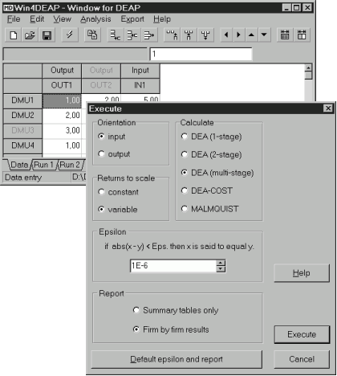

# **Win4DEAP**

**Version 1.1.4**  
**© copyright 2002-2014 Michel Deslierres**
 

**Win4DEAP** fournit une interface Windows conviviale pour le programme **DEAP** de Tim Coelli. Comme le nom l'indique, **Win4DEAP** ne remplacent pas **DEAP**. C'est ce dernier qui effectue les calculs numériques nécessaires à l'analyse de l'enveloppement des données (AED). **Win4DEAP** ne peut pas effectuer de calculs AED sans une copie installée de `DEAP.EXE`. En revanche, `DEAP.EXE`, un programme de console DOS, fonctionne parfaitement sans **Win4DEAP**.

Si c'est possible, Win4Deap 2, une nouvelle version incompatible avec Win4DEAP, devrait être utilisée de préférence. Ce qui suit n'est d'intérêt qu'aux historiens des logiciels obscurs de Windows 98.

 

**Table des matières**

<!-- TOC -->

- [1. Introduction](#1-introduction)
- [2. Obtention de **Win4DEAP**](#2-obtention-de-win4deap)
- [3. Installation](#3-installation)
- [4. Exemples de fichiers](#4-exemples-de-fichiers)
- [5. Mode d'emploi](#5-mode-demploi)
- [6. Suppression de **Win4DEAP**](#6-suppression-de-win4deap)
- [7. AVIS DE NON-RESPONSABILITÉ et AVERTISSEMENTS](#7-avis-de-non-responsabilité-et-avertissements)
- [8. WinDEAP.sas](#8-windeapsas)
- [9. Remerciement](#9-remerciement)
- [10. Dernières modifications](#10-dernières-modifications)

<!-- /TOC -->

## 1. Introduction

L'application fournit une grille semblable à une feuille de calcul pour saisir les données et créer les fichiers d'instructions et de données nécessaires pour **DEAP**. Cela signifie qu'il est possible d'avoir des fichiers de données dans un dossier autre que celui de **DEAP**. **Win4DEAP** est une application Windows 32 bits. Il a été testé sur Windows XP, Vista, 7 et 8.1 (32 et 64 bits) mais il fonctionne probablement sur toutes les versions de Windows à partir de Windows 98.

La capture d'écran montre la page de saisie de données de **Win4DEAP** . Il contient les données du premier fichier d'exemple fourni par le professeur Coelli avec son programme **DEAP** . Les résultats après deux exécutions de `DEAP.EXE` sont disponibles, mais ne peuvent pas être vus. Ils seraient visibles en appuyant sur l'onglet `Run 1` ou `Run 2`. Une troisième analyse est sur le point d'être réalisée. Notez comment `DMU3` et `OUT2` sont désactivés. Ils ne seront pas inclus dans le calcul des scores d'efficacité.

## 2. Obtention de **Win4DEAP**

Deux versions sont disponibles :

1. `WinDEAP114.EXE`  ([lien de téléchargement](`WinDEAP114.EXE` ))

Un programme d'installation qui s'occupe de la plupart des détails. Son utilisation est décrite ci-dessous. Les fichiers `.ded` sont associés à **Win4DEAP** lors de l'installation.

| Hash |  `WinDEAP114.EXE`  checksum  |
|---   |--- |
| md5  | 3cd6c27762a35239487e2541c29f3ecf|
| sha1 | 4d2577e911b303fb8e58b78a466407e903450b56 |

2. WinDEAP114.ZIP ([lien de téléchargement](WinDEAP114.zip)) 

Tous les fichiers pour faire votre propre installation.

| Hash |  WinDEAP114.zip checksum  |
|---   |--- |
| md5  | 937bdefe9ab995b9f148279ce99b0323 |
| sha1 | 7ff12d31c38684c38f6fd5b5834fa8a79ed97ac3 |

Cliquez sur les liens ci-dessus pour obtenir le fichier correspondant. 

Puis cliquez sur l'icône `Download raw file` pour lancer le téléchargement. Après le téléchargement du fichier, veuillez vérifier les sommes de contrôle pour vous assurer que le téléchargement s'est produit sans erreur. Il est très important d'effectuer ces vérifications, surtout si vous avez téléchargé les fichiers depuis un autre site. Voir aussi l'[avertissement](#7-avis-de-non-responsabilité-et-avertissements) au sujet de l'ajout de programmes potentiellement indésirables par certains sites.

## 3. Installation

1. Assurez-vous que le programme de Tim Coelli `DEAP.EXE`  est installé et fonctionne avant d'installer **Win4DEAP**. Il se trouve au Centre d'analyse de l'efficacité et de la productivité de l'Université du Queensland. Cela mérite d'être répété, assurez-vous que `DEAP.EXE` cela fonctionne avant d'essayer d'installer **Win4DEAP** .

   Les versions plus récentes de Windows sont moins tolérantes et il sera difficile d'exécuter `DEAP.EXE` à partir du dossier `Program Files` ou `Program Files (x86)`. Il est préférable d'installer **DEAP** dans son propre sous-dossier d'un dossier où l'utilisateur dispose des droits de propriétaire, tel que le dossier `Documents`.

1. Supprimez toute ancienne version de **Win4DEAP** . Si le programme d'installation a été utilisé avec l'ancienne version, il existe un programme de désinstallation pour le supprimer.

1. Lancez le programme d'installation en cliquant sur le fichier `WinDEAP114.EXE` téléchargé auparavant.

    Le dossier de destination de **Win4DEAP** peut être n'importe quel dossier souhaité pour autant que l.

    **Win4DEAP** peut être installé dans le même répertoire que `DEAP.EXE` . Cela éliminera la nécessité de passer à l’étape suivante. Cliquez sur le dossier contenant `DEAP.EXE` dans le dialogue `Select Destination Directory`. Il se peut que `\Win4DEAP` soit alors ajouté au répertoire (voir la figure ci-dessous où `DEAP.EXE` se trouve dans le répertoire de `C:\Program Files\DEA\deap`). Éliminez cet `\Win4DEAP` inutile. Répondez `Yes` lorsqu'on vous demande si `you would like to install to that directory anyway`.

     

1. Si **Win4DEAP** a été installé dans un répertoire autre que celui de **DEAP**, il faudra préciser l'emplacement de `DEAP.EXE`. Cela doit être fait une fois. Cela peut être fait maintenant ou lors de la première exécution de `Win4DEAP.EXE`. Pour le faire maintenant, démarrez `Win4DEAP.EXE` et cliquez sur `Preferences` dans le menu `File`. Entrez le chemin complet vers `DEAP.EXE`. Il sera clair si le chemin est correct ou non.

    
    

## 4. Exemples de fichiers

Les quatre exemples de Tim Coelli sont fournis au format **Win4DEAP** (extension `.ded`). Ils se trouvent dans un dossier appelé, à juste titre, `Examples` qui se trouve lui-même dans le dossier contenant  `Win4DEAP.EXE` a été installé.

## 5. Mode d'emploi

**Win4DEAP** se comporte un peu comme une feuille de calcul. Il devrait être relativement facile à utiliser pour ceux qui sont familiers avec Excel, Quattro etc. Depuis la version 1.1.0, un fichier d'aide est inclus avec **Win4DEAP**.

Par défaut, l'aide au format WinHelp ne s'affiche pas sous Windows Vista, 7 ou 8. WinHelp peut être installé gratuitement sur de tels systèmes. Consultez http://support.microsoft.com/kb/917607 pour plus de détails et des liens vers le logiciel. Si vous ne souhaitez pas installer WinHelp, ou si cela ne fonctionne pas, une version du fichier d'aide au format `chm` (html compilé) plus récent est installée avec **Win4DEAP**. Le fichier `chm` peut être affiché à partir du menu `Aide`. Malheureusement, **Win4DEAP** lui-même ne connaît pas ce fichier et ne peut pas l'utiliser pour afficher des rubriques d'aide contextuelle.

## 6. Suppression de **Win4DEAP**

Un programme de désinstallation est installé avec Win4`DEAP.EXE` . Consultez le fichier d'aide pour plus de détails.

## 7. AVIS DE NON-RESPONSABILITÉ et AVERTISSEMENTS

**Win4DEAP** est un logiciel gratuit fourni tel quel. L'auteur du programme n'accepte aucune responsabilité pour les dommages qui pourraient être causés par ce logiciel et n'offre aucune garantie, implicite ou implicite, quant à son adéquation à quelque usage que ce soit. L'utilisateur assume tous les risques associés au programme.

**Win4DEAP** doit être considéré comme un logiciel bêta. Sauvegardez souvent les données au format `.ded` natif et aux formats CSV et TXT.

Je vous recommande fortement de télécharger cette application à partir d'ici ou à partir d'une source fiable (comme un professeur la rendant disponible sur l'intranet du campus). Certains sites douteux en font la publicité d'une manière qui masque sa source, peut-être même en regroupant des **programmes potentiellement indésirables** avec **Win4DEAP**.

> Il y avait un site intitulé *How To Fix Michel Deslierres Win4DEAP*, qui faisait un peu peur. Qu'est-ce qui devait être corrigé, moi ou mon logiciel ? Le site propose un utilitaire pour tout réparer. D'ailleurs, le site affirmait que cet outil fonctionnait sur Android même si mon application ne peupt pas être installé sur ce système d'exploitation. Encore plus drôles sont les 5 étoiles qu'il s'attribue, revendiquant 361 927 téléchargements (1) en novembre 2015 seulement. Statistique plutôt surprenant étant donné que **Win4DEAP** n'a jamais été téléchargé plus de 100 fois en un an !
>
> On ne peut pas réparer quoi que ce soit lié à **Win4DEAP**(2). Je n'ai jamais publié le code et je ne le ferai jamais. C'est tout simplement trop moche.
>
> Si vous disposez d'une application ou d'un document qui, selon vous, serait utile aux utilisateurs de **Win4DEAP**, créez des liens séparés vers `WinDEAP114.EXE`  et votre matériel supplémentaire.
>
>(1) Le chiffre est issu d'un contrôle du 6 décembre 2015 sur ce site, disons *amusant*.
>
>(2) À l'exception de la suppression de l'application et de ses entrées dans le registre.

## 8. WinDEAP.sas

Le fichier `WinDEAP.sas` ([lien de téléchargement](WinDEAP.sas)) est une macro qui génère un fichier `.ded` pour **WinDEAP** à partir d'un ensemble de données SAS. De plus amples explications sont contenues dans le commentaire au début du fichier. Ce fichier a été créé par Julien Ciccone.

## 9. Remerciement

Merci à Tim Coelli pour **DEAP** sans lequel **Win4DEAP** ne sert à rien.

Merci à Jordan Russell pour le compilateur Inno Setup qui a été utilisé pour créer le programme d'installation. Le compilateur d'installation est disponible sur le Web à l'adresse http://www.innosetup.com .

Merci à Jean-Marc Huguenin, Université de Lausanne, d'avoir mentionné **Win4DEAP** dans le chapitre intitulé "Data Envelopment Analysis" auquel il a contribué dans l'ouvrage *Multi-criteria Decision Analysis: Methods and Software*, Alessio Ishizaka & Philippe Nemery éditeurs (2013) John Wiley et fils. Voir aussi son article *Data Envelopment Analysis (DEA) Un guide pédagogique à l'intention des décideurs du secteur public IDHEAP* - Cahier 276/2012, Institut de hautes études en administration publique.

Merci encore à Jean-Marc Huguenin d'avoir identifié un bogue dans les versions précédentes de **Win4DEAP** qui a été corrigé dans la version 1.1.3.

Merci à Alessio Ishizaka, CORL, Université de Portsmouth pour avoir souligné qu'un bogue majeur a été créé lors de la correction du plus petit bogue mentionné ci-dessus.

Merci à Julien Ciccone d'avoir fourni la macro `WinDEAP.sas`.

## 10. Dernières modifications

Version 1.1.4 (10 octobre 2014)

- Le menu Importer perdu a été restauré.
- Ajout de Converter.EXE  avec une importation de fichiers CSV améliorée.
- Ajout d'un choix pour afficher le fichier d'aide chm dans le menu Aide.
- Suppression de FixDragMode et retour à l'affichage scintillant lors du redimensionnement de la fenêtre.
- Changement esthétique dans la fenêtre principale, l'étiquette identifiant les coordonnées des données en cours d'édition peut désormais être redimensionnée.
- Fichiers d'aide mis à jour.

Version 1.1.3 (29 septembre 2012)

- Numéro de version fixe pour qu'il soit le même partout (j'espère !).
- Correction d'un bogue signalé par Jean-Marc Huguenin (merci) concernant la précision des résultats complets ou synthétiques.
- Compatibilité Windows 7 vérifiée.
- Ajout de la version .chm du fichier d'aide et d'un lien vers WinHelp pour Vista et Windows 7.
- Modification de la gestion du redessinage de la fenêtre lors du déplacement ou du redimensionnement d'une fenêtre.
- Ajout du programme FixDragMode pour restaurer manuellement le dessin complet de la fenêtre lors du dimensionnement et du déplacement des fenêtres.
